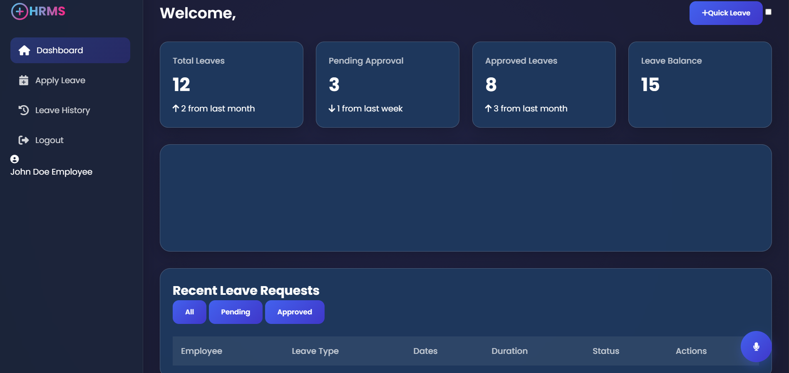
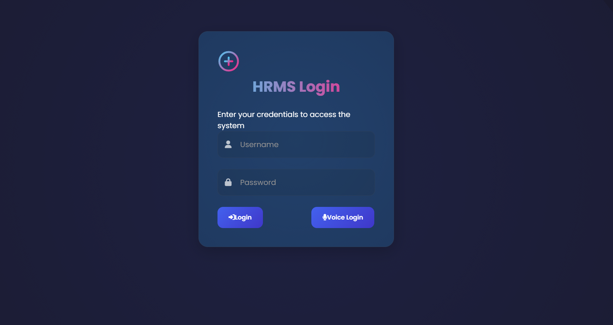
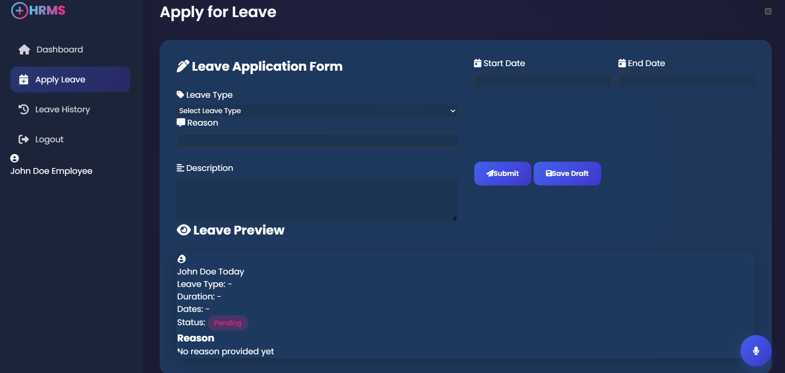

# LeaveNest - HRMS Leave Management System



## ✨ Features
- **Voice Command Integration** for login and navigation
- **Glassmorphism UI** with dynamic lighting effects
- **Dark/Light Mode** toggle
- **Responsive Design** works on all devices
- **Real-time Notifications** for all actions
- **Interactive Dashboard** with leave statistics

## 🛠 Technology Stack
- **Frontend**: HTML5, CSS3, JavaScript (ES6+)
- **Libraries**: Chart.js, Flatpickr
- **APIs**: Web Speech API for voice commands

## 📂 Project Structure
```
LeaveNest/
├── index.html          # Landing page
├── login.html          # Login page
├── dashboard.html      # Main dashboard
├── applyLeave.html     # Leave application
├── approval.html       # Manager approvals
├── leaveHistory.html   # Leave history
├── assets/
│   ├── css/
│   │   └── style.css   # All styles
│   └── js/
│       ├── auth.js     # Authentication
│       ├── dashboard.js
│       ├── applyLeave.js
│       ├── approval.js
│       └── leaveHistory.js
├── screenshots/        # Project screenshots
└── README.md           # This file
```

## 🚀 How to Run
1. Clone the repository:
   ```bash
   git clone https://github.com/yourusername/LeaveNest.git
   cd LeaveNest


2. Open index.html in your browser


## 🎤 Voice Commands
Try these after clicking the microphone:

"Login as admin"

"Go to dashboard"

"Show leave history"


## 🌓 Dark/Light Mode
Toggle the switch in the header to change themes.


## 📸 Screenshots

|  |  |
|----------------------------------------|-----------------------------------------------|
| Voice-enabled Login                    | Leave Application Form                        |


## 🎉 Thanks for checking out this project!
## Let me know if you need any improvements. 🚀
